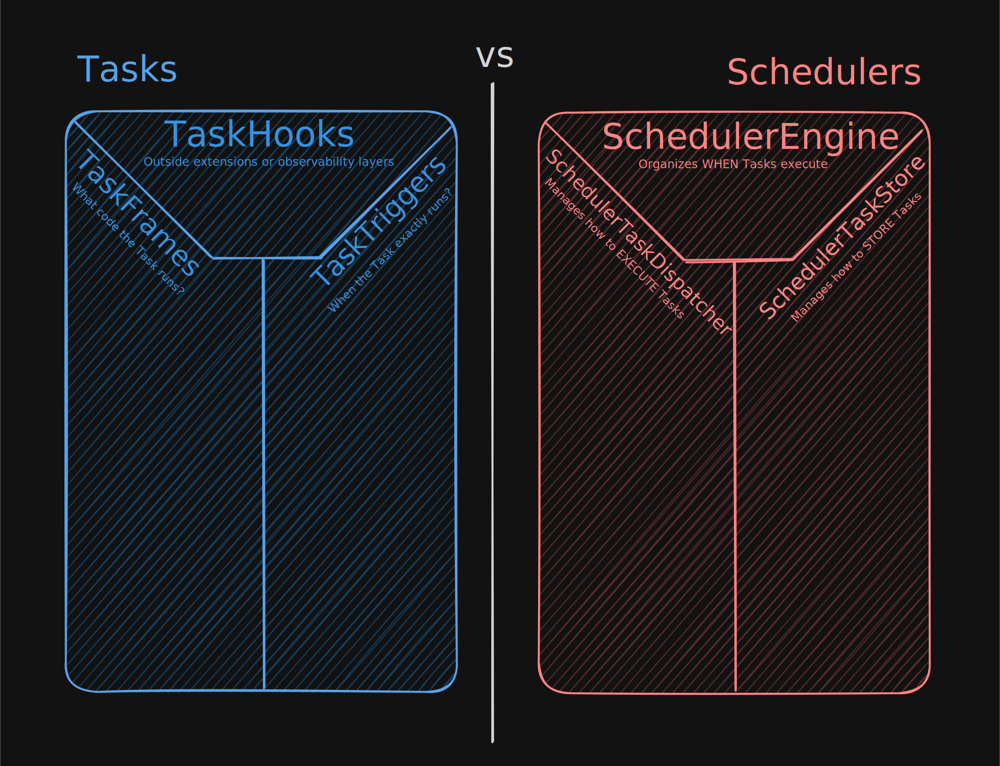
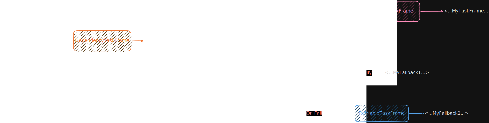
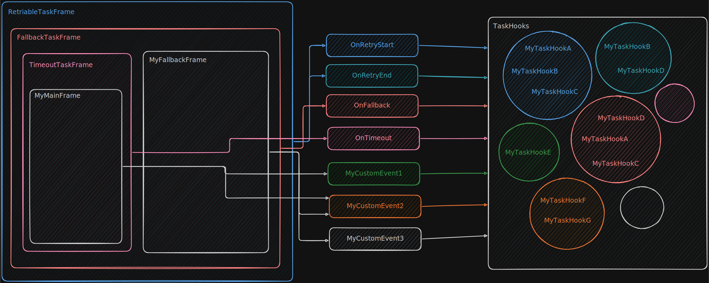

# Overview & Philosophy
Chronographer is an unopinionated composable scheduling library built in Rust.

Core Tenets:
- **Composability:** Complex behavior is built by combining simple, single-responsibility TaskFrames (for tasks) or
  by replacing various components with your own implementations of them (for schedulers and tasks).
- **Ergonomics:** 2 Levels are present in ChronoGrapher for describing complex workflows, schedulers... etc. The 
  <u>Macros Level</u> providing the most ergonomics and the <u>Base Level</u> for runtime-based flexibility, mix and
  match the use of these 2 levels.
- **Extensibility:** All core components are built to be heavily extended, and they are defined as traits. 
  Various patterns are possible with ChronoGrapher's few "simple" components without the typical bloat.
- **Efficiency:** Leverages Rust's ownership, various optimized data structures and Rust's async model to build a robust and concurrent core.
- **Language Agnostic:** The core is designed to be the backbone for future language SDKs. Available in Python, Js/Ts, Java... etc.

ChronoGrapher's core design philosophy is defined as:
> Minimallism over Bloat, Emergent over Predefined, Simplicity Over Complexity*

Specifically it is separated to 3 parts:
- **Minimalism over Bloat** Provide as few but fundamental building blocks / systems which users can compose to build 
something more complex (vs. Defining many systems each with their own complexities that do only one thing).
- **Emergent over Predefined** The systems in question should be as expressive as possible, favor making the system have 
multiple patterns which it can be used and favor integration with other systems (vs. Defining disjointed 
single-purpose systems which require hacky workarounds to do something).
- <b>Simplicity Over Complexity (*)</b> The library should be as simple as possible to use, any feature added onto a system
introduces complexity for the developer to understand (vs. Frameworks with a sprawling number of complex systems to learn
for only one thing).

<strong>(*)</strong> Complexity and power <u>is a spectrum</u>, and should be balanced (with a small bias towards power use). As such, 
simplifying a system which has tons of flexibility may not always be the right approach (as some flexibility may be lost).

# Core Abstractions
Chronographer defines two main systems, those being **Tasks** and **Schedulers**, they are broken down
into multiple sub parts each specialized in one thing and only. Each of these systems is separate on its own and rarely
know information about each other (especially Tasks to Schedulers).

Creating said systems is as simple as combining them, these systems aren't only fancy wrappers around their underlying 
composites, but may also include additional (immutable) features.

The definition of a ``Task`` is as follows
> ChronoGrapher's unit of work which includes business / execution logic code to be executed at a given time.

Whereas the definition of a ``Scheduler`` is:
> An orchestrator storing, executing, scheduling and generally managing various kinds of Tasks. 

At a high level. Tasks contain the following three composites:
- **TaskFrames** They answer the question of <u>"WHAT code does the Task run"</u>, a simple interpretation is to define
them as just functions, however they are far more powerful than they may first seem (will be explored soon).
- **TaskTriggers** They answer the question of <u>"WHEN does the Task run?"</u>, they are much simpler than ``TaskFrames``
but still a vital part. When triggered they may await for unknown period of time to announce what time they want to schedule
the Task.
- **TaskHooks** While an optional layer on top of Tasks, they are one of the more powerful features. They allow to embed
extra information onto a Task, listen to certain events, execute various side effects if present, and even communicate with 
each other (will also be explored soon).

Schedulers include their own set of composites:
- **SchedulerEngine (*)** This is the Scheduler's brain, they manage how Tasks are sorted from earliest to latest. They
retrieve a set of Tasks that are due at a specific time, the way they organize said Tasks can be as simple as a binary heap
to distributed coordination.
- **SchedulerTaskDispatcher** Defines the environment in which Tasks are executed, how they reschedule afterward and how
Tasks can be canceled. A dispatcher could execute its own sandbox environment, setup various configurations... etc.
- **SchedulerTaskStore** Manages storing and defining how other Scheduler composites access / interact with said Tasks.
  Their storage model may be a simple collection stored in RAM, a local database, a distributed file server (DFS) or even a mix.

<strong>(*)</strong> The ``SchedulerEngine`` includes an inner composite called the ``SchedulerClock`` while not truly
a direct scheduler composite, it manages how time behaves and moves forward (most of the time only the progressive clock
is used, but still useful for simulations).

With the brief overviews of the composites out, before we dive to ``Tasks`` and then move on to ``Schedulers`` (as Tasks
are the system interacted most frequently with). It is best to analyze the lifecycle of Tasks and how they are ultimately run.

# Lifecycle of ``Tasks``
> **NOTE:** As of the time of writing this, there is an issue open for rethinking the lifecycle of Tasks. This document
may be updated some time in the future to reflect the final changes but for now we will only describe the current planned way.
For more information, look into [GitHub Issue 154#](https://github.com/GitBrincie212/ChronoGrapher/issues/154).

The lifecycle of a Task begins with its intermediate temporary representation of ``Task<T1, T2>``. The goal of this
representation is to act as a container which hosts our TaskFrame, TaskTrigger and various TaskHooks. It indicates no
ownership and is present in a typed form.

Its storage model is inefficient but simple as its only temporary and not an actual long-lived object. It should be noted
that passing down references involveds ``&T`` (or ``&mut T`` for anything that wants to modify this representation). Hence, it
cannot be shared between threads (it is not meant to).

Afterward when this intermediate representation is passed down to other portions of code, it can be scheduled via a Scheduler
using the ``store(...)`` method (requires ownership of the Task).

Once scheduled the ``Scheduler`` internally destructures the ``Task<T1, T2>`` to get its contents, reassembles it into
a new much efficient representation and then stores that representation. Finally returning a ``TaskHandle`` back to the user.

This ``TaskHandle`` allows not only interacting with the ``Task`` (its contents are kept) but also allows controlling its
lifecycle via scheduler-based operations such as scheduling, running, cancelling or even removing said Task.

Unlike the intermediate representation via ``Task<T1, T2>``, the handle is cheap to clone and shareable between threads,
but its TaskFrame / TaskTrigger are fully erased (only the erased version is accessible).

When it comes to scheduling and running a Task, it can be accomplished via the TaskHandle's ``schedule(...)`` method.
Multiple instances may be scheduled at a time, the current number of instances can be fetched via ``instances(...)``.

These instances can be canceled at any time via ``cancel(...)`` or ``cancel_all(...)``. There are additional methods but
these are the most important, after an instance is scheduled it goes through the process of:
1. ``Scheduler`` triggers the ``TaskTrigger`` to decide a new time (waits around as well).
2. Once ``TaskTrigger`` announces the new time, it pushes the Task, and it's time to ``SchedulerEngine`` to organize.
3. Once it notices the Task is due, it alerts the ``SchedulerTaskDispatcher`` to dispatch the current Task.
4. When the ``SchedulerTaskDispatcher`` sets up its environment, it runs the Task emitting relevant events in the process
and executing the workflow defined via ``TaskFrame``.
5. Once the workflow finishes, it returns either success or a failure (an error) which the ``Scheduler`` handles by fully
terminating all instances of a ``Task`` and printing to the console the error.
6. On success, it repeats this process for an infinite number of times til the ``Task`` is canceled or removed.

A Task may be removed via ``remove(...)`` where it fully removes the Task, cancelling its instances and invalidating all handles.

# How Task's Composites Work
Now it is time to discuss the finer details of how a Task is shaped (its individual composites). As discussed there are 3
composites working in unison, ``TaskFrames``, ``TaskTriggers`` and ``TaskHooks``.

## Scheduling Logic Via TaskTriggers
One of the two vital parts of a Task is scheduling, which is where ``TaskTrigger`` comes in. When invoked it simply waits
around and when it feels ready (from calculations or something else) it returns the new time. 

It should be noted when it is the current or pastime, the Scheduler immediately executes the Task.
TaskTriggers may also await for something external before announcing (such as an API request).

ChronoGrapher already provides its own set of scheduling primitives such as:
- **TaskScheduleImmediate** A primitive which schedules a Task to execute immediately.
- **TaskScheduleInterval** A primitive which schedules a Task per-interval basis.
- **TaskScheduleCron** A primitive which schedules a Task based on a CRON expression.
- **TaskScheduleCalendar** A primitive which schedules via a human-readable calendar object.

## Workflows & TaskFrames
As we discussed a ``TaskFrame`` is in simple terms a function returning nothing on success and an error on failure. This
function also accepts a ``TaskFrameContext`` used for extracting information about the ``Task`` and doing all kinds of operations.

However, by wrapping ``TaskFrames`` on top of each other which do their own operations and running a ``TaskFrame``, one 
can create **Workflows** which are various ``TaskFrames`` wrapping one after the other (similar to the decorating pattern in OOP).

The wrappers are specialized ``TaskFrames`` and are called **Workflow Primitives**. ChronoGrapher has builtin various workflow
primitives ready to be used and configurable such as:
- **``RetriableFrame``:** Automatic retries for a TaskFrame with configurable backoff strategies
- **``TimeoutFrame``:** Enforce execution time limits on a TaskFrame (otherwise a timeout error is thrown if exceeded).
- **``FallbackFrame``:** If the primary TaskFrame fails, switch to a secondary TaskFrame.
- **``ConditionalFrame``:** Conditional execution of a TaskFrame via an outside predicate.
- **``ThresholdTaskFrame``:** Similar to ``TimeoutFrame`` but for enforcing a threshold for run count.
- **``DependencyFrame``:** Executes a TaskFrame if its dependencies are resolved (can depend on other Tasks).
- **``DelayFrame``:** Delays the execution of a TaskFrame.

A workflow may look something like this (represented as a diagram):

There are various ways to construct a workflow such as via the macros, via a builder pattern with ``TaskFrameBuilder`` or
creating manually the ``TaskFrames`` with their respective constructors.

> **NOTE 1#** The order of TaskFrames in a workflow **MATTER**, for example ``fallback -> retry -> T`` does not produce
the same results as executing ``retry -> fallback -> T``. The former runs a global fallback catching any errors not handled
by retry. While the latter runs multiple retries with a local fallback per retry of ``T``.

> **NOTE 2#** There can be multiple ``TaskFrames`` of the same type (as observed in the diagram). This is useful as each 
workflow primitive can have its own scope of its nested parts. For example a ``TimeoutTaskFrame`` could be used at the
top for a global timeout enforced throughout the workflow and another before entering a ``TaskFrame`` for local timeouts.

``TaskFrames`` may use the **Shared Data API** to expose shared objects in their nested ``TaskFrame(s)``, works similarily
in spirit to [React's Context API](https://react.dev/learn/scaling-up-with-reducer-and-context). Shared objects can be
read by the nested parts (or even written to via interior mutability).

> **NOTE:** When multiple shared objects are attached, only the last one attached is ever seen, when that is removed the
> second last may be accessed and so on (basically a stack).

## TaskHooks & Extensibility
TaskHooks are essential for defining extensions, without them. ChronoGrapher wouldn't be as powerful as it is now. So
what are they really?

On the surface, they may look like your typical event listeners just typed, where a ``TaskHook`` instance may listen
any number of events and have different code run per event (while managing the event's payload).

New events can be defined by you via the ``TaskHookEvent`` trait which is just a marker type. Allowing you to emit them
in any section of code you would like. While this is their common main use case, there are also pattern associated with them:
- **TaskHook Side Effects** ``TaskFrames``, ``Schedulers`` composites or anything outside can check if certain TaskHooks
  are available on a Task and run different code depending on their existence, even as far as modifying state (if the TaskHooks allow).
- **Hook-To-Hook Communication** ``TaskHooks`` may define their own subset of events in which they emit, other 
  ``TaskHooks`` may listen to the event and even emit their own events back (this can allow for coordination between ``TaskHooks``).
- **State Managers / Markers** Via the special event ``()``, ``TaskHooks`` may embody as state managers (containers in which
they only host and expose state) or just markers. For eventful ``TaskHooks``, they can also include their own state.
- **Internal TaskHooks** ``TaskFrames`` can attach their own TaskHooks temporarily for introspection and afterward remove 
  them (or keep them around), this is basically the pattern that makes up the **Shared Data API**.
- **THEG(s)** or more known as "**T**ask**H**ook **E**vent **G**roup**s**", in basic terms they are traits which
require the ``TaskHookEvent`` trait. They allow to generalize payloads and event listening methods as opposed
to writing one by one.

> **NOTE:** Since the **Shared Data API** is built from ``TaskHooks``, this mechanism described in the above note applies
> to ``TaskHooks``.

