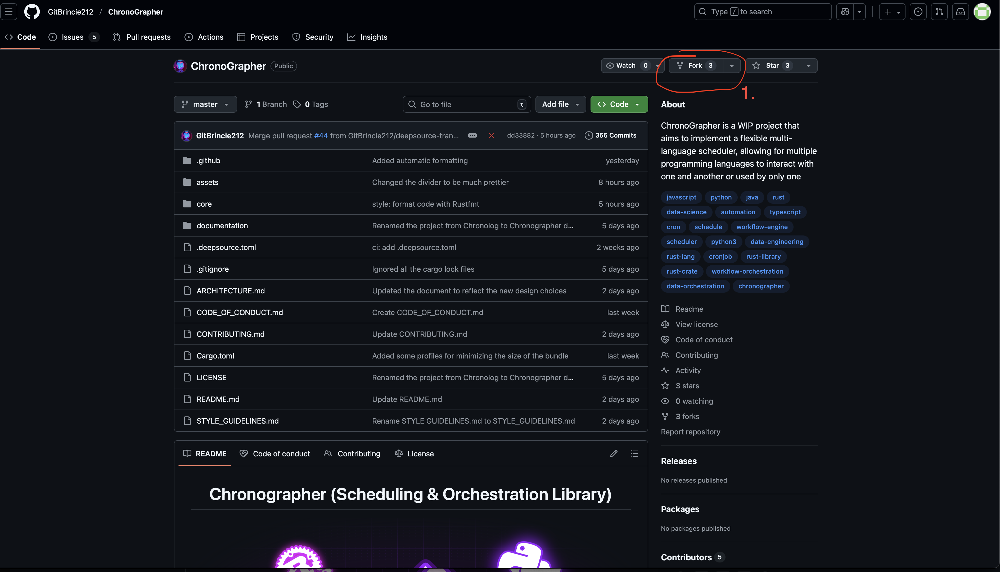
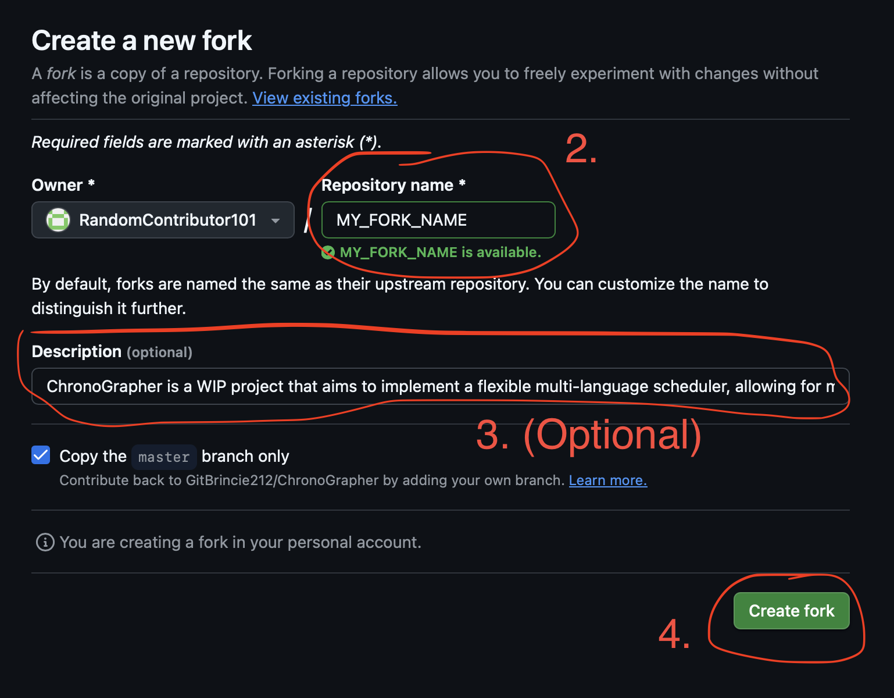

# Contributing
Before discussing how to contribute to the project, it is heavily appreciated and admired for you
to consider to contribute to the project, we welcome new contributors with wide open arms as this project
is built from the community. When contributing to this project, please first discuss the change you wish to
make via issue or any other method with the owners of this project (GitBrincie212) before making a change.

This document provides a guide to making your contribution process and efforts as a smooth sailing and 
effective experience as possible

# Code of Conduct
By participating in this project, you are expected to uphold our Code of Conduct. Please 
read and follow the [Code of Conduct](CODE_OF_CONDUCT.md) to ensure a respectful and inclusive environment 
for everyone.

# Getting Started
1. Fork the repository on GitHub:


2. Follow the process as outlined by GitHub:


3. Clone your fork locally:
    ```shell
    git clone https://github.com/RandomContributor101/MY_FORK_NAME.git
    cd MY_FORK_NAME
    ```

4. Add the upstream remote to stay synced with the main project repo:
    ```shell
    git remote add upstream https://github.com/GitBrincie212/Chronographer.git
    ```
5. Ensure you have the latest Rust toolchain as the project uses the latest stable Rust. We recommend using 
[rustup](https://rustup.rs):
    ```shell
    rustup update stable
    ```
6. **(Optional)** Look into GitHub issues for any potential one that is good for newcomers and start by
there, implementing the feature, bug fixes or changes requested on the issue
7. Make your relevant code changes
8. Run the unit tests (and make your own depending on the changes) to ensure everything works:
    ```shell
    cargo test
    ```
9. Look into the [STYLE GUIDELINES](./STYLE%20GUIDELINES.md) document and ensure everything is followed
10. Commit all your changes (you can commit multiple times without repeating the process 
for grouping various changes, which is one of the style guidelines)
    ```shell
    git commit -m "[COMMIT LABEL]..."
    # Common commit labels: FEATURE, FIX, DOCS, 
    # PERF, STYLE, REFACTOR, TEST, CHORE, CI
    ```

# Pull Request Process
1. Push your branch to your fork on GitHub:
    ```shell
    git push origin YOUR_BRANCH
    ```
2. Open a Pull Request (PR) against the main branch of the upstream project repository.
3. Ensure you fill out relevant information, be descriptive about the issue such as what it addresses, why is it made,
link any relevant issues...etc.
4. Ensure all CI checks are passed. The PR will automatically be checked for formatting, lints, and tests.
5. Request a review from the owner (GitBrincie212).
6. Address review feedback. This may require changes to your code. Please be responsive and discuss 
any suggestions with the owner (GitBrincie212).
7. Once approved, the owner will squash and merge your PR.